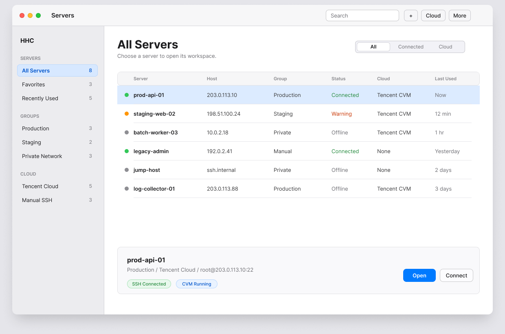
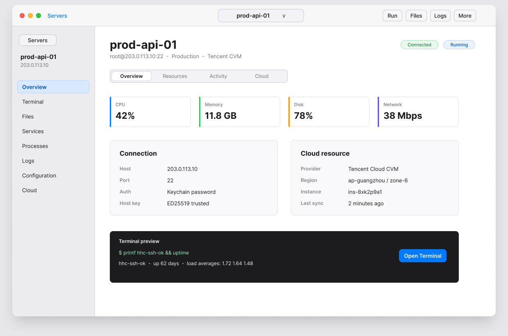
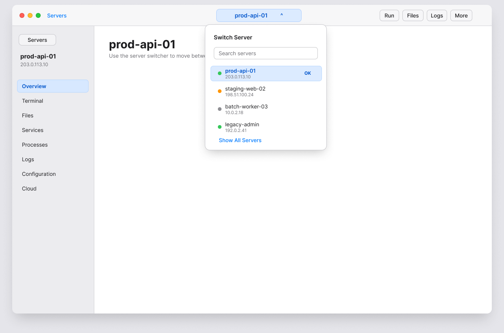
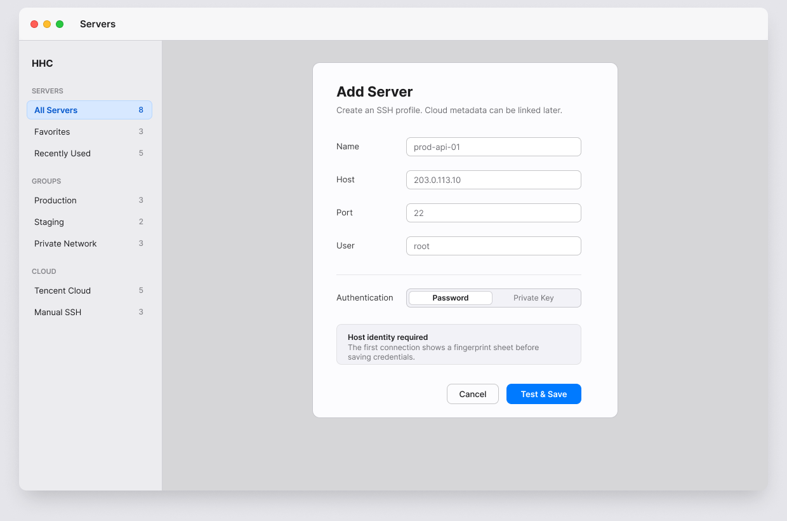
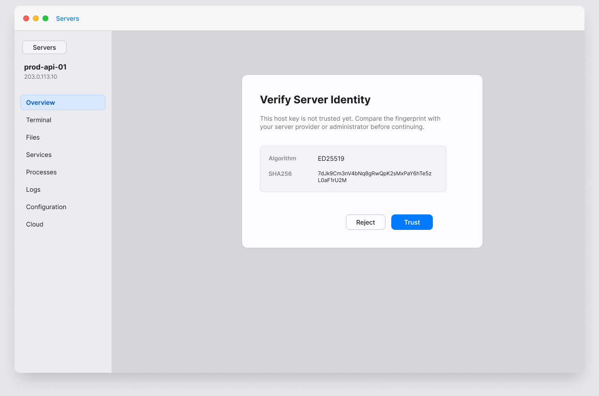

# macOS MVP v0.2 Design Snapshots

These PNG files are the repository-versioned design snapshots for the current macOS MVP direction. Open-source review and implementation should reference these checked-in snapshots.

这些 PNG 是当前 macOS MVP 方向的仓库内设计快照。开源评审和实现应直接参考这里随仓库版本管理的图片。

## Screens / 画面

1. Startup server list / 启动服务器列表

   

2. Server workspace overview / 单服务器工作台概览

   

3. Server switcher popover / 服务器切换弹窗

   

4. Add server native sheet / 添加服务器原生 Sheet

   

5. Host key trust native sheet / 主机指纹确认原生 Sheet

   
